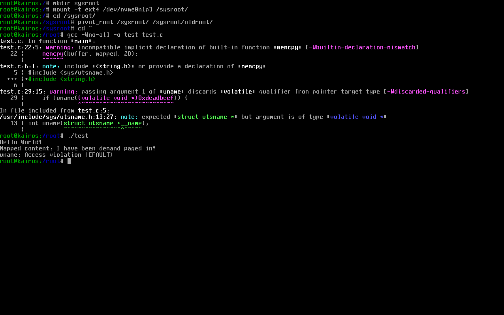
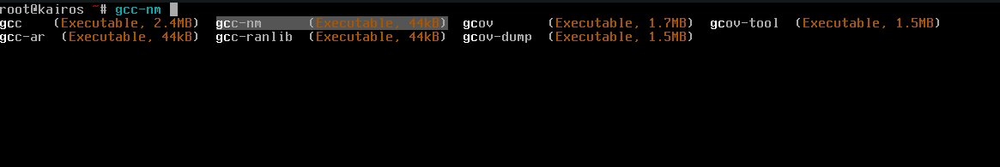

# Kairos

Kairos is an Operating System using the [Nomos](https://github.com/RaidTheWeb/nomos) kernel.

The name "Kairos" is derived from the [Ancient Greek word](https://en.wikipedia.org/wiki/Kairos) meaning 'the exact or critical time'.

## Screenshots




## Building

```sh
git clone https://github.com/RaidTheWeb/nomos
mkdir build-x86_64 && cd build-x86_64
../jinx init .. ARCH="x86_64"
../build-support/builddist.sh
KVM=1 ../build-support/run.sh
```
